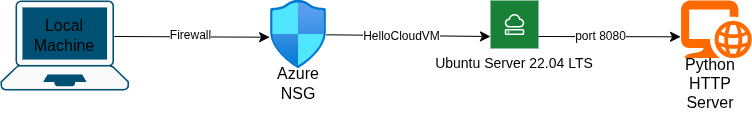

# Week 1 - Cloud Fundamentals & VM Setup

**Date Range:** June 8 – June 12, 2026  
**Status:** ✅ Done   
**Key Deliverable:** VM + SSH documentation

## ☁️ Overview

Week 1 covered getting a cloud server up and running from scratch. This included creating an Azure for Students account, deploying an Ubuntu Server VM in East Asia, configuring Network Security Group (NSG) rules, connecting via SSH from Arch Linux, and serving a simple "Hello Cloud!" HTML page over HTTP using Python's built-in server

## ☁️ Tasks Completed

| # | Task | Date Completed | Status |
|---|------|----------------|--------|
| 1 | Azure Account Setup & VM Deployment | June 9–10, 2026 | ✅ Done |
| 2 | SSH Connection from Arch Linux | June 10, 2026 | ✅ Done |
| 3 | Hello Cloud HTML Page via Python HTTP Server | June 10, 2026 | ✅ Done |

## ☁️ VM Configuration

| Setting | Value |
|---------|-------|
| VM Name | HelloCloudVM |
| Region | (Asia Pacific) East Asia |
| Image | Ubuntu Server 22.04 LTS |
| Instance Type | Standard_B2ats_v2 (2 vCPU, 2 GB RAM) |
| Public IP | Standard SKU, Static |
| NSG Inbound Rules | TCP 22 (SSH), TCP 8080 (HTTP) |

## ☁️ Files in This Folder

| File | Description |
|------|-------------|
| `README.md` | This file - week summary and deliverables |
| `commands.sh` | All CLI commands used during the week |
| `setup-notes.md` | Step-by-step task documentation |
| `architecture/diagram.png` | Cloud setup architecture diagram |

## ☁️ Key Learnings

- Cloud cost management matters - wrong disk type or forgetting to deallocate resources can silently incur charges
- Stopping a VM and *deallocating* it are different; only deallocation stops compute billing
- Azure NSG blocks all traffic by default - every port must be manually opened
- Not all cloud providers accept virtual cards (GCP rejected Maya card; Azure for Students required no card at all)
- `Standard_B1s` quota was zero across all regions - had to switch to `Standard_B2ats_v2`
- Public IP SKU mismatch is resolved by leaving IP empty during VM creation and attaching it separately after deployment

## ☁️ Issues & Resolutions

| Issue | Resolution |
|-------|------------|
| `Standard_B1s` unselectable - Bv1 quota zero on all regions | Switched to `Standard_B2ats_v2` in East Asia |
| Azure blocked several regions on student subscription | Tested regions one by one until East Asia went through |
| Public IP SKU forced Standard-Static only | Left IP field empty during VM config; attached a separate static IP resource post-deployment |
| `Microsoft.Compute` provider not registered | Manually registered via Portal --> Subscriptions --> Resource Providers |

## ☁️ Deliverables

- [/] Azure VM deployed and running (`HelloCloudVM`)
- [/] SSH access confirmed from Arch Linux (`azureuser@HelloCloudVM:~$`)
- [/] "Hello Cloud!" page served on `http://20.239.122.200:8080`
- [/] Weekly Technical Documentation Report submitted (PDF)

## ☁️ References

- [Azure for Students Free Account](https://azure.microsoft.com/en-us/free/students)
- [Quickstart: Create a Linux VM in Azure Portal](https://learn.microsoft.com/en-us/azure/virtual-machines/linux/quick-create-portal)
- [Network Security Groups Overview](https://learn.microsoft.com/en-us/azure/virtual-network/network-security-groups-overview)
- [Understand VM States and Billing](https://learn.microsoft.com/en-us/azure/virtual-machines/states-billing)
- [Python http.server - HTTP Servers](https://docs.python.org/3/library/http.server.html)
