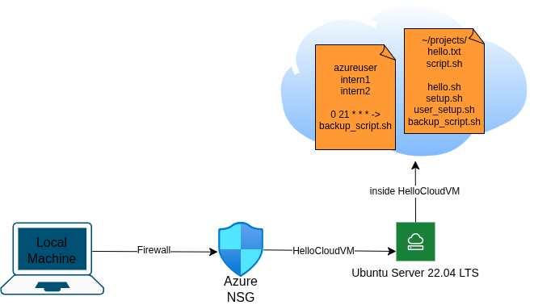

# Week 2 - Documentation of Scripts and Commands Used

**Intern:** Renz Kirby Onia
**Date Range:** June 8 – June 11, 2026
**Department:** Cloud Computing - Lamina Studios, LLC.
**Supervisor/Mentor:** April Gianan


## Overview

Week 2 focuses on Linux server administration on `HelloCloudVM` (Ubuntu 22.04 LTS, Azure East Asia) from Week 1. All tasks were completed in a single SSH session on June 10. This document covers every command and script used, what each one does, and why it was used



## Connecting to the VM

```bash
ssh -i ~/.ssh/hellocloud_key.pem azureuser@20.239.122.200
```

| Part | Explanation |
|------|-------------|
| `ssh` | Starts a secure remote shell session |
| `-i ~/.ssh/hellocloud_key.pem` | Specifies the private key file for authentication instead of a password |
| `azureuser@20.239.122.200` | The admin username and public IP of the Azure VM |


## Task 1 - System Information Check

### Commands

```bash
uname -a
```
Prints the full kernel and OS information - kernel version, hostname, architecture, and OS name. Used to confirm the VM is running Ubuntu 22.04 LTS

```bash
df -h
```
Shows disk space usage in GB/MB. The `-h` flag stands for *human-readable*. Used to check available disk space on the root partition

```bash
top
```
Opens an interactive real-time process monitor similar to Task Manager on Windows. Displays running processes, CPU usage per process, and total memory usage. Press `q` to exit


## Task 2 - File and Directory Management

### Commands

```bash
mkdir ~/projects
```
Creates a new directory named `projects` inside the home directory. `~/` always refers to the current user's home directory (`/home/azureuser`) regardless of where you currently are in the filesystem

```bash
cd ~/projects
```
Changes the current working directory to `~/projects`

```bash
echo "Hello Lamina!" > hello.txt
```
Writes the string `Hello Lamina!` into a new file called `hello.txt`. The `>` operator redirects the output of `echo` into the file, creating it if it doesn't exist and overwriting it if it does

```bash
cat hello.txt
```
Reads and prints the contents of `hello.txt` to the terminal. Used to verify the file was written correctly

```bash
sudo apt install git curl wget -y
```
Installs three development tools using Ubuntu's package manager. `sudo` runs the command with root privileges. `-y` automatically confirms the installation prompt so it doesn't pause and wait for input.

| Tool | Purpose |
|------|---------|
| `git` | Version control for cloning repos, committing, pushing to GitHub |
| `curl` | Transfers data from URLs; commonly used to test APIs and download files |
| `wget` | Downloads files from the web; useful for grabbing installers and archives |

```bash
ls -l
```
Lists files in the current directory with detailed info: permissions, owner, file size, and last modified date. The `-l` flag stands for *long format*.

```bash
chmod 644 ~/projects/hello.txt
```
Sets the file permissions of `hello.txt` to `644`: owner can read and write, group and others can only read. Used for regular text files that should not be executable.

```bash
touch ~/projects/script.sh
```
Creates an empty file named `script.sh`. `touch` creates the file if it doesn't exist, or updates its timestamp if it does.

```bash
chmod +x ~/projects/script.sh
```
Adds the execute permission to `script.sh`, making it runnable as a script. The `+x` flag adds the execute bit for owner, group, and others.

```bash
ls -l ~/projects
```
Verifies the updated permissions on both files after applying `chmod`.

### Permission Reference

| Value | Who can do what |
|-------|----------------|
| `644` | Owner: read + write / Group: read / Others: read - standard for text files |
| `+x` | Adds execute bit - makes the file runnable as a program |
| `400` | Owner read-only - used for SSH private keys |


## Task 3 - User Creation and Management

### Commands

```bash
sudo adduser intern1
```
Creates a new Linux user named `intern1`. Prompts for a password and optional profile fields (Full Name, Room Number, etc.) - pressing `Enter` skips the optional fields. Also creates a home directory at `/home/intern1` automatically.

```bash
sudo usermod -aG sudo intern1
```
Adds `intern1` to the `sudo` group, granting them administrator privileges. The `-a` flag means *append* (add to group without removing from others) and `-G` specifies the group name. Without `-a`, this command would replace all existing group memberships.


## Task 4 - Bash Script Automation

Three scripts were written on the VM using `nano` and run using `~/scriptname.sh`.

> **Note on running scripts:** `./script.sh` looks for the file relative to the current directory. `~/script.sh` always looks in the home directory regardless of where you are. All scripts here were saved to `~` so `~/` was used to run them.


### hello.sh

```bash
#!/bin/bash
# Simple automation script

echo "Welcome to Lamina Studios Cloud Training"
DATE=$(date)
echo "Today's date is: $DATE"

# List files in the home directory
ls ~
```

| Line | Explanation |
|------|-------------|
| `#!/bin/bash` | Shebang - tells the OS to run this file using the Bash interpreter |
| `echo "..."` | Prints a string to the terminal |
| `DATE=$(date)` | Runs the `date` command and stores its output in a variable called `DATE` |
| `echo "Today's date is: $DATE"` | Prints the variable value - `$` is used to reference a variable |
| `ls ~` | Lists all files in the home directory |

**How it was created and run:**

```bash
nano ~/hello.sh      # open nano editor and write the script
chmod +x ~/hello.sh  # make it executable
~/hello.sh           # run it 
```


### setup.sh

```bash
#!/bin/bash
# Auto-setup script for a new Linux instance

echo "Updating system..."
sudo apt update && sudo apt upgrade -y

echo "Installing essential tools..."
sudo apt install git curl wget build-essential -y

echo "Setup complete!"
```

| Line | Explanation |
|------|-------------|
| `sudo apt update` | Refreshes the local list of available packages from Ubuntu's repositories |
| `sudo apt upgrade -y` | Installs all pending updates for currently installed packages |
| `&&` | Runs the next command only if the previous one succeeded |
| `build-essential` | A package bundle that installs GCC, make, and other tools needed to compile software from source |

**How it was created and run:**

```bash
nano ~/setup.sh
chmod +x ~/setup.sh
~/setup.sh
```


### user_setup.sh

```bash
#!/bin/bash
# User creation script

USERNAME=$1
sudo adduser $USERNAME
sudo usermod -aG sudo $USERNAME
echo "User $USERNAME created and added to sudo group."
```

| Line | Explanation |
|------|-------------|
| `USERNAME=$1` | Assigns the first command-line argument to a variable. `$1` refers to the first word typed after the script name |
| `sudo adduser $USERNAME` | Creates the user with the name passed in as the argument |
| `sudo usermod -aG sudo $USERNAME` | Grants the new user sudo privileges |
| `echo "..."` | Confirms the operation completed |

**How it was created and run:**

```bash
nano ~/user_setup.sh
chmod +x ~/user_setup.sh
~/user_setup.sh intern2    # intern2 is passed in as $1
```


## Task 5 - Cron Job Scheduling

### backup_script.sh

```bash
#!/bin/bash
DATE=$(date +%Y%m%d_%H%M%S)
mkdir -p ~/backups
cp -r ~/projects ~/backups/projects_$DATE
echo "Backup completed: projects_$DATE"
```

| Line | Explanation |
|------|-------------|
| `date +%Y%m%d_%H%M%S` | Formats the current date and time as `20260610_214500` - used to make each backup folder uniquely named |
| `mkdir -p ~/backups` | Creates the `~/backups` directory. `-p` means no error is thrown if it already exists |
| `cp -r ~/projects ~/backups/projects_$DATE` | Recursively copies the entire `projects` folder into `backups` with the timestamp appended to the folder name. `-r` means *recursive* - required to copy directories |
| `echo "Backup completed: ..."` | Confirms which backup folder was created |

### Scheduling with crontab

```bash
crontab -e
```
Opens the cron table for the current user in a text editor. Cron is a Linux scheduler that runs commands automatically at specified times.

The following line was added:

```
0 21 * * * /home/azureuser/backup_script.sh
```

| Field | Value | Meaning |
|-------|-------|---------|
| Minute | `0` | At the 0th minute |
| Hour | `21` | At 21:00 (9 PM) |
| Day of month | `*` | Every day |
| Month | `*` | Every month |
| Day of week | `*` | Every day of the week |

> **UTC vs PHT:** The VM clock runs on UTC. `9 PM UTC` = `5 AM Philippine Standard Time (UTC+8)`. The cron job fires at 5 AM local time, not 9 PM. To schedule at 9 PM PHT, the hour field should be `13` instead (`21 - 8 = 13`).

```bash
crontab -l
```
Lists all scheduled cron jobs for the current user. Used to verify the entry was saved correctly.


## Task 6 - Resource Monitoring

```bash
top
```
Re-run to capture a live snapshot of CPU usage, load average, running processes, and memory consumption at the end of the session.

```bash
df -h
```
Re-run to document current disk usage after all installations and file operations from the week.

```bash
free -m
```
Displays RAM and swap usage in megabytes. `-m` stands for *megabytes*. Shows total, used, free, shared, buffer/cache, and available memory.

| Column | Meaning |
|--------|---------|
| `total` | Total physical RAM installed |
| `used` | Memory currently in use by processes |
| `free` | Completely unused memory |
| `buff/cache` | Memory used by the kernel for disk caching - can be reclaimed if needed |
| `available` | Memory actually available for new processes (free + reclaimable cache) |
